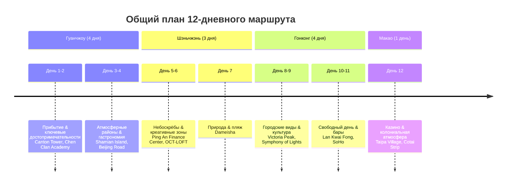
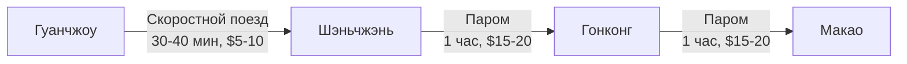

# 🌆 Подробный план путешествия: Гуанчжоу, Шэньчжэнь, Гонконг, Макао (12 дней)

## 📋 Краткая сводка путешествия

## 💰 Бюджетная сводка (на человека в долларах США)

| Категория | Бюджет | Примечания |
| :--- | :--- | :--- |
| **Проживание** | $400 | 8 ночей (4 в Гуанчжоу оплачены, 4 в Шэньчжэне/Гонконге/Макао) |
| **Питание** | $300 | Уличная еда, кафе, рестораны ($20-30 в день) |
| **Транспорт** | $150 | Метро, поезда, паромы между городами |
| **Достопримечательности** | $100 | Входные билеты, смотровые площадки |
| **Казино/Развлечения** | $100 | Небольшие ставки, просто посмотреть |
| **Прочее** | $50 | Сувениры, непредвиденные расходы |
| **ИТОГО** | **$1100** | Из $2500 бюджета, остаток ~$1400 на непредвиденные расходы |

> 💡 **Совет**: Бюджет рассчитан на эконом-путешествие с акцентом на уличную еду и бюджетные отели. Гонконг будет самым дорогим городом, Макао — самым дешевым для еды.

## 📍 Подробный маршрут по дням

### 🏙️ Гуанчжоу (Дни 1-4)

**День 1: Прибытие и знакомство с городом**
- **Утро**: Прибытие в аэропорт Гуанчжоу Байюнь, трансфер в отель (район Haizhu Square или Beijing Road)
- **День**: Прогулка по **Пешеходной улице Шансяцзю** — атмосферное место с традиционной архитектурой и уличной едой
- **Вечер**: Посещение **Храма Большого Будды (Dafo Temple)** — тихое место для фото
- **Питание**: Уличная еда — **чашеобразная лапша (wonton noodles)**, **манго саго**
- **Бюджет дня**: $30 (еда + транспорт)

**День 2: Небоскрёбы и закат на реке**
- **Утро**: **Canton Tower (Кантонская башня)** — подъем на смотровую площадку (билеты ~$5)
- **День**: Прогулка по набережной **Жемчужной реки**, посещение **Музея пива Чжуцзян** (с экскурсией и обедом)
- **Вечер**: **Круиз по Жемчужной реке** — закат (лучшее время ~18:30-19:00)
- **Питание**: **Жареный гусь** (местное блюдо), **димсамы**
- **Бюджет дня**: $40 (билеты на башню, круиз, еда)

**День 3: Атмосферный старый город**
- **Утро**: **Храм предков Чэнь (Chen Clan Academy)** — образец лингнаньской архитектуры
- **День**: Прогулка по **острову Шамянь** — колониальная архитектура, тенистые аллеи
- **Вечер**: Покупки на **Пекинской улице (Beijing Road)** — под стеклянным полом видны древние мостовые
- **Питание**: **Чаоаньский говяжий хот-пот**, **суп из акулиного плавника**
- **Бюджет дня**: $25 (входные билеты, еда)

**День 4: Гастрономический день и подготовка к переезду**
- **Утро**: **Мемориал Сунь Ятсена** — историческое место, рядом с Шамянь
- **День**: **Гастрономический тур по районам Ливан** — посещение **Ливанского музея** и **Ливанского парка**
- **Вечер**: Прощальный ужин в **ресторане Dim Du Dou** — традиционные кантонские десерты
- **Питание**: **Пирожные из яичного белка**, **суп из сладкого картофеля**
- **Бюджет дня**: $30 (музеи, еда)

### 🏙️ Шэньчжэнь (Дни 5-7)

**День 5: Переезд и знакомство с городом**
- **Утро**: Скоростной поезд Гуанчжоу-Шэньчжэнь (30-40 минут, $5-10), заселение в отель (район Futian или Luohu)
- **День**: Прогулка по **Пешеходной улице Dongmen** — магазины, снэк-бары, уличная еда
- **Вечер**: **Смотровая площадка Free Sky на 116-м этаже Ping An Finance Centre** (билеты от $44)
- **Питание**: **Сычуаньский хот-пот** (Haidilao — известен сервисом), **северо-западная китайская кухня**
- **Бюджет дня**: $50 (билеты на смотровую, поезд, еда)

**День 6: Искусство и креативные зоны**
- **Утро/День**: **OCT-LOFT (Креативный парк OCT)** — бывшая промышленная зона, теперь модный район с галереями и кафе
- **День**: Посещение **Старого книжного магазина** и **% Arabica** (спешелти-кофейня)
- **Вечер**: Закат на набережной рядом с **MOCAPE** (Музей современного искусства)
- **Питание**: **Местная уличная еда**, **десерты в кафе**
- **Бюджет дня**: $25 (еда, транспорт)

**День 7: Природа и пляж**
- **Утро**: Поездка в **Дамейша (Dameisha)** — пляжный район с атмосферой французского курорта
- **День**: Прогулка по променаду, обед в пляжном кафе
- **Вечер**: Возвращение в центр, прощальный ужин
- **Питание**: **Морепродукты**, **местные закуски**
- **Бюджет дня**: $30 (транспорт, еда)

### 🏙️ Гонконг (Дни 8-11)

**День 8: Переезд и Симфония огней**
- **Утро**: Паром Шэньчжэнь-Гонконг (1 час, $15-20), заселение в отель (Tsim Sha Tsui или Central)
- **День**: Прогулка по **Набережной Чимсачёй (Tsim Sha Tsui Promenade)** — виды на небоскребы острова Гонконг
- **Вечер**: **Симфония огней (A Symphony of Lights)** — лазерное шоу на заливе в 20:00
- **Питание**: **Димсамы**, **жареный рис с морепродуктами**
- **Бюджет дня**: $35 (паром, еда)

**День 9: Пик Виктория и бары**
- **Утро**: **Пик Виктория (Victoria Peak)** — подъем на историческом трамвайчике или автобусе, посещение **Sky Terrace 428**
- **День**: Обед в **The Peak Galleria**, спуск в район **Central/SoHo**
- **Вечер**: Прогулка по **Стаунтон-стрит (Staunton Street)** и **Эльджин-стрит (Elgin Street)** — бары, рестораны, бутики
- **Питание**: **Международная кухня в SoHo**, **коктейли в баре Ozone** (118-й этаж Ritz-Carlton)
- **Бюджет дня**: $40 (билеты на пик, еда, напитки)

**День 10: Пляж и ночная жизнь**
- **Утро/День**: Поездка на пляж **Repulse Bay (Залив Отпор)** или **Big Wave Bay**
- **Вечер**: Возвращение в город, исследование **Lan Kwai Fong (Лан Квай Фонг)** — центр ночной жизни
- **Питание**: **Пляжные кафе**, **уличная еда на ночных рынках**
- **Бюджет дня**: $30 (транспорт, еда)

**День 11: Свободный день**
- **Утро**: **Храмовый рынок (Temple Street Night Market)** — сувениры, уличная еда
- **День**: **Монастырь Чилинь** и **Сад Нан-Лиан** — тихие, красивые места
- **Вечер**: Прощальный ужин в **ресторане с видом на залив**
- **Питание**: **Местные деликатесы**, **десерты**
- **Бюджет дня**: $35 (покупки, еда)

### 🎰 Макао (День 12)

**День 12: Казино и колониальная атмосфера**
- **Утро**: Паром Гонконг-Макао (1 час, $15-20), заселение в отель на **Котай-Стрип** или в **Старом Макао**
- **День**: Прогулка по **Деревне Тайпа (Taipa Village)** — португальская архитектура, кафе
- **День**: Посещение **Rua do Cunha (Гуанье-стрит)** — пешеходная улица с магазинами местных деликатесов
- **Вечер**: Прогулка по **Котай-Стрип** — осмотр гранд-казино:
  - **The Venetian (Венеция)** — гондолы, внутренние каналы
  - **The Londoner (Лондонер)** — копия Биг-Бена
  - **Parisian (Парижанин)** — копия Эйфелевой башни
  - **MGM Cotai** — элегантный интерьер
- **Питание**: **Португальские яичные тарты (egg tarts)**, **африканская курица**
- **Бюджет дня**: $40 (паром, еда, небольшие ставки в казино)

## 🍜 Гастрономические рекомендации

### 🥟 Обязательные блюда для дегустации

| Блюдо | Город | Где попробовать | Цена |
| :--- | :--- | :--- | :--- |
| **Чашеобразная лапша (wonton noodles)** | Гуанчжоу | Уличные кафе на Шансяцзю | $2-3 |
| **Жареный гусь** | Гуанчжоу | Ресторан Bingtang Hugu | $5-7 |
| **Димсамы** | Гуанчжоу/Гонконг | Ресторан Yonghe Palace (Гуанчжоу), Dim Du Dou | $4-6 |
| **Манго саго** | Гуанчжоу | Десертные кафе на Beijing Road | $2-3 |
| **Чаоаньский говяжий хот-пот** | Гуанчжоу | Ресторан Chaozhou Beef Hotpot | $6-8 |
| **Сычуаньский хот-пот** | Шэньчжэнь | Haidilao (сервис с видом) | $8-10 |
| **Португальские яичные тарты** | Макао | Lord Stow's Bakery, Cunha Food Street | $1-2 |
| **Африканская курица** | Макао | Рестораны в Taipa Village | $5-7 |

### 🍹 Кафе и бары с видом

📍 Список рекомендуемых кафе и баров

**Гуанчжоу:**
- **Bingtang Hugu** — суп с лапшой и говядиной, рядом с Canton Tower
- **Yonghe Palace** — димсамы, недалеко от Beijing Road
- **Rooftop бар на 70-м этаже Canton Tower** — панорамные виды (нужна бронь)

**Шэньчжэнь:**
- **% Arabica** в OCT-LOFT — спешелти-кофе
- **Старый книжный магазин** — кафе с атмосферой
- **Бар на 116-м этаже Ping An Finance Centre** — виды на город

**Гонконг:**
- **Ozone** (118-й этаж Ritz-Carlton) — самый высокий бар в мире
- **Sevva** — атмосферный бар в Central
- **Café в The Peak Galleria** — виды с пика Виктория

**Макао:**
- **The Manor** — ресторан в Taipa Village
- **The St. Regis Bar** — элегантный бар
- **Chiado (the Londoner Macao)** — ресторан в казино

## 🏨 Рекомендации по проживанию

| Город | Район | Тип жилья | Цена за ночь | Преимущества |
| :--- | :--- | :--- | :--- |
| **Гуанчжоу** | Haizhu Square / Beijing Road | Бюджетный отель | $30-40 | Центр, транспорт, еда |
| **Шэньчжэнь** | Futian / Luohu | Бизнес-отель | $40-50 | Транспорт, магазины |
| **Гонконг** | Tsim Sha Tsui / Central | Хостел/Бюджетный отель | $50-70 | Вид на залив, транспорт |
| **Макао** | Cotai Strip / Old Macau | Бюджетный отель | $30-40 | Близость к казино, еда |

> 💡 **Совет**: В Гонконге можно рассмотреть хостелы с приватными комнатами — это сэкономит бюджет. В Макао отели на Котай-Стрип дороже, но удобнее для казино.

## 🚇 Транспорт между городами

🚌 Внутригородской транспорт

**Гуанчжоу и Шэньчжэнь:**
- **Метро** — основной транспорт, цена $0.5-1 за поездку
- **Автобусы** — дешевле, но сложнее для новичков
- **Приложения**: Metro Man, Citymapper

**Гонконг:**
- **Octopus Card** — для транспорта и покупок
- **MTR** (метро) — быстрый и удобный
- **Звездный паром** — между островом Гонконг и Коулуном

**Макао:**
- **Автобусы** — дешевый транспорт
- **Пешком** — многие достопримечательности в пешей доступности
- **Бесплатные шаттлы** от казино до паромных терминалов

## 🎰 Казино Макао: рекомендации для осмотра

### 🏛️ Казино для осмотра (без крупных трат)

| Казино | Особенности | Что посмотреть | Бюджет на игру |
| :--- | :--- | :--- | :--- |
| **The Venetian** | Копия Венеции с каналами | Гондолы, внутренние площади | $10-20 на автоматы |
| **The Londoner** | Копия Лондона с Биг-Беном | Архитектура, площадь | $10-20 на автоматы |
| **Parisian** | Копия Эйфелевой башни | Башня, световое шоу | $10-20 на автоматы |
| **MGM Cotai** | Элегантный интерьер | Хрустальная люстра, фонтаны | $10-20 на автоматы |
| **Wynn Palace** | Роскошный декор | Лазерное шоу, сады | $10-20 на автоматы |

> 💡 **Совет**: В казино можно просто гулять и смотреть — это бесплатно. Небольшие ставки на автоматы ($10-20) дадут возможность поучаствовать в процессе без крупных трат. Многие казино предлагают бесплатные напитки для игроков.

## 📅 Полный бюджет на 12 дней (на человека)

| Категория | Детализация | Сумма |
| :--- | :--- | :--- |
| **Проживание** | 8 ночей ($40-50/ночь) | $320-400 |
| **Питание** | 12 дней ($25-30/день) | $300-360 |
| **Транспорт** | Между городами + внутренний | $150-200 |
| **Достопримечательности** | Башни, музеи, круизы | $80-100 |
| **Казино/Развлечения** | Небольшие ставки, бары | $100-150 |
| **Прочее** | Сувениры, непредвиденное | $50-100 |
| **ИТОГО** | | **$1000-1310** |
| **Остаток от $2500** | | **$1190-1500** |

## 🏥 Здоровье и отдых

⚠️ Важные советы для здоровья

1. **Частые остановки**: План составлен с учетом необходимости отдыха — каждый 2-3 часа остановки в кафе
2. **Вода**: Всегда носите с собой бутылку воды (купите многоразовую)
3. **Еда**: Начинайте с небольших порций уличной еды, чтобы проверить реакцию организма
4. **Медстраховка**: Обязательно оформите с покрытием в Китае
5. **Аптека**: Носите с собой базовые лекарства (обезболивающие, от расстройства желудка)
6. **Обувь**: Удобная обувь для долгих прогулок (кроссовки или сандалии)
7. **Солнцезащита**: Крем, очки, головной убор — солнце сильное
8. **Отдых в отеле**: Планируйте 1-2 часа отдыха днем, особенно в жару

## 📸 Лучшие места для фото

### 🌅 Закат и рассвет

| Место | Город | Время | Тип фото |
| :--- | :--- | :--- | :--- |
| **Круиз по Жемчужной реке** | Гуанчжоу | Закат (~18:30-19:00) | Городской пейзаж |
| **OCT-LOFT** | Шэньчжэнь | Закат (~18:00) | Индустриальная архитектура |
| **Пик Виктория** | Гонконг | Закат (~18:00) | Городской пейзаж |
| **Набережная Чимсачёй** | Гонконг | Симфония огней (20:00) | Лазерное шоу |
| **Деревня Тайпа** | Макао | Утро (~8:00) | Колониальная архитектура |

### 🏙️ Городские виды

- **Canton Tower** (Гуанчжоу) — виды на город и реку
- **Free Sky 116** (Шэньчжэнь) — панорама города
- **Sky Terrace 428** (Гонконг) — 360-degree виды
- **Казино на Котай-Стрип** (Макао) — архитектура

## 💡 Практические советы

1. **Связь**: Купите eSIM (Airalo) или местную SIM-карту при прилете
2. **Платежи**: Alipay и WeChat Pay принимаются везде — привяжите иностранную карту
3. **Язык**: В Гуанчжоу и Шэньчжэне — путунхуа, в Гонконге и Макао — кантонский, но английский распространен
4. **Еда**: Используйте приложение **Dianping** (китайский Yelp) для поиска кафе рядом
5. **Транспорт**: В Гонконге используйте **Octopus Card**, в других городах — **Alipay** для метро
6. **Отдых**: Планируйте 1-2 часа отдыха днем, особенно в жару
7. **Казино**: В Макао казино открыты 24/7, вход свободный, дресс-код casual

## 📋 Контрольный список перед поездкой

- [ ] Проверить срок действия паспорта (минимум 6 месяцев)
- [ ] Оформить медстраховку с покрытием в Китае
- [ ] Скачать приложения: Maps.me, Dianping, Google Translate (с офлайн-пакетами)
- [ ] Купить eSIM или местную SIM-карту
- [ ] Подготовить наличные (доллары) для обмена
- [ ] Уведомить банк о поездке за границу
- [ ] Сделать копии документов (паспорт, страховка)
- [ ] Проверить вакцинации (рекомендованы: гепатит А, Б, тиф)
- [ ] Купить удобную обувь для долгих прогулок
- [ ] Подготовить солнцезащитный крем и очки

## 🔄 Гибкость маршрута

> ⚠️ **Важно**: Маршрут составлен с запасом на отдых и спонтанность. При необходимости:
> - Сократите количество достопримечательностей в день
> - Добавьте больше времени в кафе и парках
> - Замените некоторые места на альтернативные
> - Используйте свободный день в Гонконге (день 11) для отдыха или дополнительных посещений

## 📞 Экстренные контакты

- **Единый номер экстренных служб**: 110 (полиция), 120 (скорая), 119 (пожарная)
- **Посольство/Консульство**: Проверьте контакты вашей страны в Китае
- **Медстраховка**: Сохраните номер полиса и телефон ассистанс
- **Отель**: Сохраните адрес и телефон на китайском

## 🎯 Итог

Этот план разработан с учетом вашего бюджета ($2500 на человека, включая оплаченные перелеты и 4 ночи в Гуанчжоу), предпочтений (небоскребы, уличная еда, бары, здоровье друга) и интересов (осмотр казино в Макао как развлечение). Маршрут балансирует между популярными местами и атмосферными районами, с частыми остановками для отдыха.

> 🌟 **Совет**: В Гонконге (день 11) оставлен свободный день — используйте его для отдыха, шопинга или повторного посещения любимых мест. В Макао казино — это не только игра, но и архитектурный опыт: гуляйте по Котай-Стрип и наслаждайтесь декором.

**Удачного путешествия!** 🌏✈️
